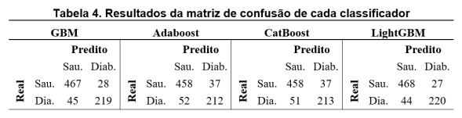
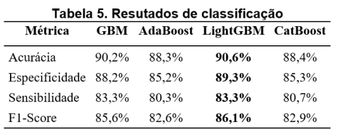
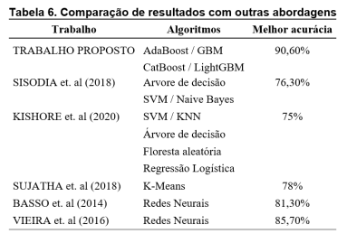

# Uso de Classificadores Boosting para Detecção de Diabetes
Código do artigo "Aplicação de Classificadores Boosting para Detecção de Diabetes" publicado no VII Encontro Regional de Engenharias (Norte). Disponível em: <https://issuu.com/encoeng1/docs/anais_encoeng_2020>

## Conteúdo
- [Problema](#problema)
  - [Classificadores](#classificadores)
- [Materiais e métodos](#materias-e-metodos)
  - [Base de dados](#base-de-dados)
  - [Pré-processamento](#pre-processamento)
  - [Treinamento e avaliação dos classificadores](#treinamento-avaliacao)
  - [Aprimoramento de hiperparâmetros](#aprimoramento-hiperparametros)
  - [Métricas de avaliação](#metricas-avaliacao)
- [Resultados](#resultado)

## Problema

Diabetes Mellitus (DM) é uma doença grave e crônica que ocorre quando o pâncreas não produz insulina (hormônio que regula a glicemia) suficiente ou quando o corpo não pode usar efetivamente a insulina que produz (OMS, 2016). 
Muitas abordagens clássicas de Aprendizado de Máquina são propostas na literatura para fazer a detecção de DM, porém pouco se tem falado sobre o uso de classificadores boosting.

### Classificadores

- [Gradient Boosting Machine - GBM](https://towardsdatascience.com/understanding-gradient-boosting-machines-9be756fe76ab)
- [AdaBoost](https://blog.paperspace.com/adaboost-optimizer/#:~:text=AdaBoost%20is%20an%20ensemble%20learning,turn%20them%20into%20strong%20ones.)
- [LightGBM](https://lightgbm.readthedocs.io/en/latest/)
- [CatBoost](https://catboost.ai)

## Materiais e métodos

### Base de dados

[Pima Indians Diabetes](https://www.kaggle.com/datasets/uciml/pima-indians-diabetes-database)

### Pré-processamento

- [x] - Exploração da base e identificação de missing values
- [x] - Normalização Min-Max
- [x] - Identificação e tratamento de outliers

### Treinamento e avaliação

- [x] - Validação cruzada com k = 5 folds

### Aprimoramento de hiperparâmetros

- [x] - Uso da busca em grade (Grid Search)(https://scikit-learn.org/stable/modules/grid_search.html)
- [x] - Validação cruzada (k = 5) 

### Métricas de avaliação

- [Matriz de confusão](https://towardsdatascience.com/various-ways-to-evaluate-a-machine-learning-models-performance-230449055f15)
- [Acurácia](https://towardsdatascience.com/various-ways-to-evaluate-a-machine-learning-models-performance-230449055f15)
- [Especificidade](https://towardsdatascience.com/various-ways-to-evaluate-a-machine-learning-models-performance-230449055f15)
- [Sensibilidade](https://towardsdatascience.com/various-ways-to-evaluate-a-machine-learning-models-performance-230449055f15)
- [F1-Score](https://towardsdatascience.com/various-ways-to-evaluate-a-machine-learning-models-performance-230449055f15)

## Resultados

### Matriz de confusão

<h1 align='center'>
  
</h1>

### Métricas

<h1 align='center'>
  
</h1>

### Comparação com resultados da literatura

<h1 align='center'>
  
</h1>
